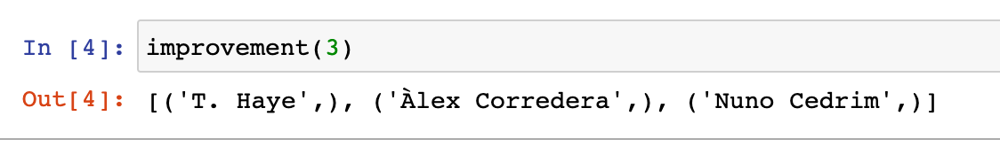

# Project Repository

The purpose of this project is to do data analysis on a soccer player statistics dataset. The dataset we should use is <a href="https://www.kaggle.com/stefanoleone992/fifa-20-complete-player-dataset?select=players_20.csv" target="_top"> FIFA Dataset available on Kaggle</a>. This dataset contains Soccer player statistics for 2015-2020.

## Step 1: Create the DB table to store the players_20 dataset and populate it with data. 


For this purpose we need to created a schema with the name “fifa”:

```sql
create schema fifa
```
Then we need to use the players_20 in the data folder to  create a table called players_20:


``` sql
CREATE TABLE fifa.players_20 (
	sofifa_id INT NOT NULL, 
	player_url VARCHAR(100) NOT NULL, 
	...
	rcb VARCHAR(4), 
	rb VARCHAR(4)
);
```

After this, to populate the table with data we use:

```sql
\COPY fifa.players_20 FROM 'data/players_20.csv' DELIMITER ',' CSV HEADER
```
Then we will get table with constraints like below (shown in DbVisualizer)


The SQL code about creating tables are stored in src folder as create_table.sql


## Step 2: Create reusable Python functions for different tasks

First we import two packages, which are pytest and psycopg2 (remember to install them first!)

```python
import pytest
import psycopg2
```
After import two packages, we should write two functions:

The first one is connect_db, this fucntion will enable the connection to database and schema where you placed your table.

```python
#This funciton will enable the connection to database and schema where you placed your table.
def connect_db():
        conn = psycopg2.connect(
                        host="localhost", 
                        port="5432",
                        user=username, 
                        password=password, 
                        database="postgres",
                        options="-c search_path=schema"
                    )
        cur = conn.cursor()
        return cur, conn

```

The second function is save_and_terminate_connection. 

```python
#This function will closes the cursor, sends a COMMIT statement and close the connection to PostgresSQL
def save_and_terminate_connection(cur, conn):
    cur.close()
    conn.commit()
    conn.close()
```
This function will enable us to :

1. closes the cursor, resets all results, and ensures that the cursor object has no reference to its original connection object. 

2. sends a COMMIT statement to the PostgresSQL server, committing the current transaction. 

3. close the connection to PostgresSQL

<br>

We then created five funcitons showing how to get the information we want form the players_20 table.


```python
#This funciton will list the x players who achieved highest improvement across all skillsets.
def improvement(num):
    command = """  select short_name
                    from fifa.players_20
                    order by ((skill_dribbling+skill_curve+skill_fk_accuracy+skill_long_passing+skill_ball_control)/5)-overall  desc
                    ;"""
    cur, conn = connect_db()
    cur.execute(command)
    row = cur.fetchmany(num)
    return row
    save_and_terminate_connection(cur, conn)
```

This funciton will list the x players who achieved highest improvement across all skillsets.  The assumption for this question is that the improvement for each player can be calculated by the average of kill_dribbling, skill_curve, skill_fk_accuracy, skill_long_passing and skill_ball_control minus overall.


<br>
For this output, the x is 3.

```python
#This funciton will list the y clubs that have largest number of players with contracts ending in 2021. 
def club_largest_2021(num):
    command = """  select club from fifa.players_20
                    where contract_valid_until=2021
                    group by club
                    order by count(short_name) desc
                    ;"""
    cur, conn = connect_db()
    cur.execute(command)
    row = cur.fetchmany(num)
    return row
    save_and_terminate_connection(cur, conn)
```

This funciton will list the y clubs that have largest number of players with contracts ending in 2021. 


<br>
For this output, the y is 3.

```python
#This funciton will list the z clubs with largest number of players in the dataset where z >= 5.
def club_z_greater5(num):
    command = """  select club from fifa.players_20
                    group by club
                    having count(distinct short_name) >=5
                    order by count(distinct short_name)desc,club desc
                    ;"""
    cur, conn = connect_db()
    cur.execute(command)
    row = cur.fetchmany(num)
    return row
    save_and_terminate_connection(cur, conn)
```

This funciton will list the z clubs with largest number of players in the dataset where z >= 5.


<br>
For this output, the z is 3.

```python
#This funciton will list the most popular nation_position in the dataset.
def nation_position():
    command = """  select nation_position from fifa.players_20
                    group by nation_position
                    order by count(nation_position) desc
                    limit 1
                    ;"""
    cur, conn = connect_db()
    cur.execute(command)
    row = cur.fetchmany()
    return row
    save_and_terminate_connection(cur, conn)
```

This funciton will list the most popular nation_position in the dataset.


<br>
From this output, the most popular nation_position in the dataset is SUB.


```python
#This funciton will list the most popular team_position in the dataset.
def team_position():
    command = """  select team_position from fifa.players_20
                    group by team_position
                    order by count(team_position) desc
                    limit 1;
                    ;"""
    cur, conn = connect_db()
    cur.execute(command)
    row = cur.fetchmany()
    return row
    save_and_terminate_connection(cur, conn)
```

This funciton will list the most popular team_position in the dataset.


<br>
From this output, the most popular team_position in the dataset is SUB.


```python
#This funciton will list the most popular nationality for the players in the dataset.
def nationality():
    command = """  select nationality from fifa.players_20
                    group by nationality
                    order by count(short_name) desc
                    limit 1;
                    ;"""
    cur, conn = connect_db()
    cur.execute(command)
    row = cur.fetchmany()
    return row
    save_and_terminate_connection(cur, conn)
```

This funciton will list the most popular nationality for the players in the dataset.


<br>
From this output, the most popular nationality in the dataset is England.
<br>
<br>

## Step 3: Develop unit tests to cover ALL the functions that were developed above
<br>
<br>

To develop unit tests, we need to add a function like below and put it in the same python file with all the other previously-written funcitions. 

```python
#his function will allow us to test all our previously written functions. 
def test_task2():
    assert improvement(3) is not None, "Returned should not be None"
    assert club_largest_2021(3) is not None, "Returned should not be None"
    assert club_z_greater5(3) is not None, "Returned should not be None"
    assert nation_position() is not None, "Returned should not be None"
    assert team_position() is not None, "Returned should not be None"
    assert nationality() is not None, "Returned should not be None"

    assert len(improvement(3)) == 3, "Returned should be length 3"
    assert len(club_largest_2021(4)) == 4, "Returned should be length 4"
    assert len(club_z_greater5(5)) == 5, "Returned should be length 5"
    assert len(nation_position()) == 1, "Returned should be length 1"
    assert len(team_position()) == 1, "Returned should be length 1"
    assert len(nationality()) == 1, "Returned should be length 1"

    assert improvement(3) == [('T. Haye',), ('Àlex Corredera',), ('Nuno Cedrim',)], "Returned value"
    assert club_largest_2021(4) == [('1. FC Kaiserslautern',), ('FC Ingolstadt 04',), ('FC Girondins de Bordeaux',), ('Kasimpaşa SK',)], "Returned value"
    assert club_z_greater5(5) == [('Wolverhampton Wanderers',), ('West Ham United',), ('Watford',), ('VfL Wolfsburg',), ('Valencia CF',)], "Returned value"
    assert nation_position() == [('SUB',)], "Returned value"
    assert team_position() == [('SUB',)], "Returned value"
    assert nationality() == [('England',)], "Returned value"
```
This function will allow us to test all our previously written functions. All we need to do is to write some commands in the terminal. 

First we should try pytest to test whether all functions are correctly written and give the correct output.
```console
pytest test_project.py
```
This will show like below in our console.


Then we use the coverage package to generate a html report

```console
coverage run -m pytest test_project.py
coverage html
```

There will give us a html file in a folder called htmlcov and it will look like below:


This html tells us that we passed all the tests for the functions and we tested 87% of the code we've written.


## Step4: Dockerize our application

After writing these commands in Dockerfile, we will be able to Dockerize our SQL and Python file.

```console
FROM postgres:latest
RUN apt-get update
RUN apt-get install python3 -y
RUN apt-get install python3-pip -y
RUN pip3 install psycopg2-binary
RUN pip3 install pytest
```


## Step 5: Use Python’s Seaborn library to develop visualizations.

For this step we need to import 3 packages: psycopg2, seaborn and pandas


```python
import psycopg2
import seaborn as sns  
import pandas as pd
```


```python
#This funciton will graphically display the 10 players who have achieved the highest improvement across all skillsets
def display_player1():
    cur, conn = connect_db()
    q1 = pd.read_sql_query(
        '''select short_name, ((skill_dribbling + skill_curve + skill_fk_accuracy + skill_long_passing + skill_ball_control)/5 - overall) as improvement
            from players_20
            order by improvement desc
            limit 10''', conn)
    df = pd.DataFrame(q1, columns=['short_name', 'improvement'])
    return df
    save_and_terminate_connection(cur, conn)
df=display_player1()
sns.set_style("whitegrid")
ax=sns.barplot(x="short_name", y="improvement", data=df)
ax.set_xticklabels(ax.get_xticklabels(), rotation=45, horizontalalignment='right')
ax.set_title('10 players who have achieved the highest improvement across all skillsets')

```
This funciton will graphically display the 10 players who have achieved the highest improvement across all skillsets


```python
#This funciton will graphically displays the 5 players with highest value (value_eur).
def display_player2():
    cur, conn = connect_db()
    q1 = pd.read_sql_query(
        '''select short_name,value_eur
           from fifa.players_20
           order by value_eur desc
           limit 5''', conn)
    df = pd.DataFrame(q1, columns=['short_name', 'value_eur'])
    return df
    save_and_terminate_connection(cur, conn)
df=display_player2()
sns.set_style("whitegrid")
ax=sns.barplot(x="short_name", y="value_eur", data=df)
ax.set_xticklabels(ax.get_xticklabels(), rotation=45, horizontalalignment='right')
ax.set_title('5 players with highest value ')
```
This funciton will graphically displays the 5 players with highest value (value_eur).


```python
#This funciton will graphically displays the 10 players with the largest number of player_traits. (If there are more than 10 players, e.g. (players 9, 10, and 11 include same number of player traits), include all of them in the visualization)
def display_player3():
    cur, conn = connect_db()
    q1 = pd.read_sql_query(
        '''select short_name, count(player_traits)as count_traits
           from fifa.players_20  
           group by short_name
           order by count(player_traits) desc
           limit 28''', conn)
    df = pd.DataFrame(q1, columns=['short_name', 'count_traits'])
    return df
    save_and_terminate_connection(cur, conn)
df=display_player3()
sns.set_style("whitegrid")
ax=sns.barplot(x="short_name", y="count_traits", data=df)
ax.set_xticklabels(ax.get_xticklabels(), rotation=45, horizontalalignment='right')
ax.set_title('10 players with highest player traits ')
```
This funciton will graphically displays the 10 players with the largest number of player_traits. (If there are more than 10 players, e.g. (players 9, 10, and 11 include same number of player traits), include all of them in the visualization)


